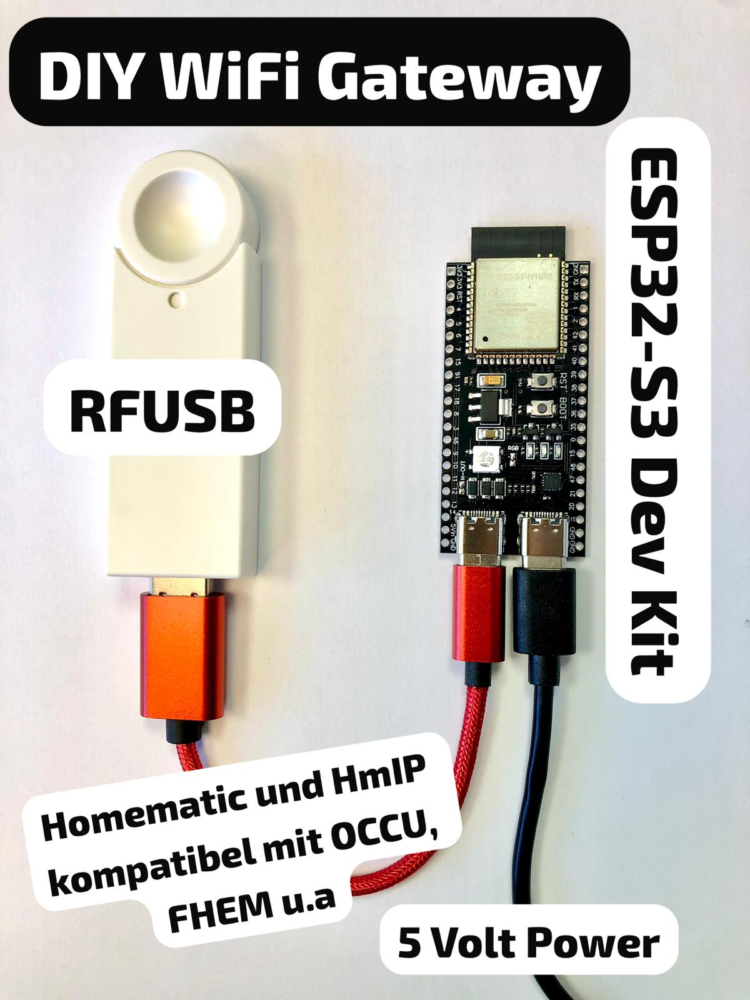

# RFNETHM — HmIP-Funk übers Netzwerk

<p align="center">
  
</p>

**Ein Adapter, der einen unmodifizierten HmIP-RFUSB-Stick (oder ein
RPI-RF-MOD / HM-MOD-RPI-PCB am Pin-Header) ins Netzwerk hängt** — statt
ihn an einen lokalen USB-Port zu zwingen.  Damit wird der Funk-Stick
zu einem netzwerkweit erreichbaren BidCoS-/HmIP-Frontend für FHEM,
Homegear, piVCCU oder RaspberryMatic — ohne dass eine echte CCU oder
ein Pi am Funk-Standort stehen muss.

Status: **Firmware v0.14.90** (2026-05-11), Devkit-Bringup abgeschlossen,
alle vier Kreuze der Ground-Truth-Matrix (HB-RF-ETH × {HM-MOD,
RPI-RF-MOD} und RFNETHM × {HM-MOD, RPI-RF-MOD}) live ge-flasht. Eigenes
PCB ist in Planung.

---

## Datenfluss

```
   HmIP-RFUSB           RFNETHM                dein Server
   (eq-3 Original)      (ESP32 + WLAN/Eth)     (FHEM, Homegear,
                                                piVCCU, RaspberryMatic)
       USB ───────────► USB-Host
                        │
                        └─── WLAN/Ethernet ───►  hb_rf_eth.ko
                                                 /dev/raw-uart
                                                 oder TCP-Socket
```

Alternativ statt USB-Stick: **RPI-RF-MOD** oder **HM-MOD-RPI-PCB**
direkt auf den 40-Pin-Header — selber Adapter, gleicher Server-Pfad.

---

## Wozu das gut ist

- **Funkstandort frei wählbar.** Stick steht da, wo der Empfang gut ist
  (Estrich, Garage, Pegel-Sweet-Spot); die Hausautomation läuft woanders.
- **Drop-in für alle gängigen Stacks.** Aus Sicht des Servers ist es
  ein normales `hb_rf_eth`-Gerät (Alex Reinerts Kernel-Modul) **oder**
  eine HM-MOD-RPI-PCB-Bridge (TCP/2330). Beide Wege gleichzeitig nutzbar.
- **Kein zusätzlicher Pi nötig.** Wer bisher einen Pi nur als Funkträger
  nutzt, kann ihn ersetzen.
- **Kein Custom-RF-Stack.** Der Funk-Teil bleibt der echte eq-3-Stick mit
  eq-3-Firmware — alle BidCoS-/HmIP-Eigenheiten, AES, Pegelhandling
  sind genauso wie im Original.

---

## Netzwerk-Schnittstellen (parallel offen)

| Port | Format | Was redet damit |
|---|---|---|
| **UDP 3008** | HB-RF-ETH wire-format | `hb_rf_eth.ko` → `/dev/raw-uart` für piVCCU / RaspberryMatic |
| **TCP 2330** | HMUARTLGW | FHEM `CUL_HM`, Homegear, jeder Stack der eine HM-MOD-RPI-PCB-Bridge erwartet |
| **TCP 2329** | Raw-Bytestream | bmcond, eigene Tools, Reverse-Engineering |
| **HTTP 80** | WebUI + REST | Status, OTA-Update, WLAN-Setup, Live-Log |
| **mDNS** | `_raw-uart._udp:3008` | Auto-Discovery (`rfnethm-XXXX.local`) |

Eingehende Funk-Frames werden gleichzeitig an alle verbundenen Clients
gespiegelt.  Senden ist mit einem **TX-Master-Soft-Lock** gegen
Mehrfach-Schreiber abgesichert (erster Sender bekommt den Stick für
5 s, danach übernimmt der nächste; per WebUI festpinnbar).

---

## Was Du brauchst

- **Funk-Hardware** (eine Variante):
  - HmIP-RFUSB-Stick (eq-3 Original, USB `1B1F:C020`), oder
  - RPI-RF-MOD am 40-Pin-Header — **braucht 5 V auf Header-Pin 2/4**
    (eigener on-board-LDO, kein 3V3-Pfad), oder
  - HM-MOD-RPI-PCB am 40-Pin-Header — 3,3 V auf Pin 1 reicht
- **ESP32-S3-Devkit** mit nativem USB-OTG-PHY (z.B. YD-ESP32-S3 V1.4)
  und Pin-Header für den HM-Modul-Slot.  Ein eigenes PCB (ESP32-S3-MINI-1
  + W5500 + USB-A + HM-Slot) ist in Vorbereitung.
- **5 V / 200 mA** Versorgung über die zweite USB-C-Buchse am Devkit.
  Wer RPI-RF-MOD nutzt, muss zusätzlich 5 V auf den HM-Header (Pin 2/4)
  durchziehen — siehe [`docs/breadboard_wiring.md`](docs/breadboard_wiring.md).
- **WLAN** im Lab — Ethernet kommt mit dem eigenen PCB-Spin.

---

## Inbetriebnahme (Kurz)

1. **Flashen.** PlatformIO-Profil `rfnethm`:
   ```
   pio run -e rfnethm -t upload
   ```
2. **WLAN provisionieren.** Zwei Wege:
   - **Improv-Serial**: Browser → improv-wifi.com → ESP über die
     Console-USB-Buchse verbinden → Credentials eingeben.
   - **Captive-AP-Fallback**: erscheint nach 30 s als WLAN
     `RFNetHM XXXX`, Handy verbindet sich, jede HTTP-Anfrage landet
     im Setup-Formular.
3. **Im WebUI** (`http://rfnethm-XXXX.local`) Status checken; alle
   Funk-Frames stehen sofort am Netzwerk-Port bereit.
4. **Server-Seite** konfigurieren:
   - piVCCU / RaspberryMatic: `hb_rf_eth.ko` mit der IP des RFNETHM laden.
   - FHEM: `define hmusb HMUARTLGW rfnethm-XXXX.local:2330`.

---

## Status — was funktioniert

**Verifiziert (live gegen reale Hardware):**

- USB-Host-Init des HmIP-RFUSB-Stick, Mode-Switch BL → App
- Beide HM-Modul-Familien am Pin-Header (HM-MOD-RPI-PCB / Co_CPU
  und RPI-RF-MOD / DualCoPro), Auto-Erkennung beim Boot
- HMUARTLGW-Codec byte-genau gegen Live-Captures
- `hb_rf_eth.ko`-Pfad bis zur Aktor-Toggle-Schaltung in RaspberryMatic
- FHEM `CUL_HM` / HMUARTLGW-Bridge bis Phase D (TX, RX, AES-Key-Storage)
- Coprocessor-Firmware-Flash von beiden Modul-Familien über bmcond
  via UDP-Transport (RPI-RF-MOD 4.4.22 ⇆ 4.2.14, HM-MOD 2.8.6 ⇆ 2.2.1)
- Multi-Client-Fanout, TX-Master-Lock, mDNS, Captive-AP-Fallback, OTA

**Nicht fertig:**

- AES-Authentifizierung in der Legacy-Bridge (Phase E — mehrtägig,
  kein Blocker für AES-aware Devices).
- Eigenes PCB (Schaltplan und Pin-Mapping stehen; siehe
  `docs/decisions.md`).

---

## Was RFNETHM **nicht** ist

- **Kein** Drop-in-Replacement für den HmIP-RFUSB am unmodifizierten
  RaspberryMatic-Kernel-Treiber: der USB-Pfad ist via ECDSA gesperrt
  (bewusste Design-Entscheidung von Alex Reinert, wird respektiert).
  Variante B des Projekts (CP2102N mit OTP-Brand `1B1F:C020`) ist eine
  separate Bauform und ohne ESP32.
- **Kein** eigenes Wireformat.  UDP/3008 mit HB-RF-ETH-Frames und
  TCP/2330 mit HMUARTLGW sind die Default-Sprachen.
- **Keine** BidCoS-/HmIP-Protokoll-Interpretation in der Stick-Firmware
  — reiner Transport, alle HM-Logik bleibt downstream.

---

## Ist das was für mich?

- **Ja**, wenn Du HmIP-Funk in einer Linux-Hausautomation (FHEM,
  Homegear, piVCCU, RaspberryMatic) nutzt und Funk-Standort vom
  Server-Standort entkoppeln willst.
- **Ja**, wenn Du einen alten Pi loswerden willst der nur den
  HmIP-Stick / das RPI-RF-MOD trägt.
- **Nein**, wenn Du eine vollständige CCU-Funktionalität ohne
  Server-Stack willst — dafür ist RaspberryMatic die richtige Adresse,
  RFNETHM ist nur der Funk-Adapter.
- **Nein**, wenn Du Klassik-Homematic-Funk (BidCoS, AskSinPP) ohne
  HmIP brauchst — da ist ein CUL/COC der bessere Match.

---

## Mehr lesen

- [`docs/intro.md`](docs/intro.md) — ausführliche Einführung
- [`docs/breadboard_wiring.md`](docs/breadboard_wiring.md) — Verkabelung
  am Devkit
- [`docs/ethernet_addition.md`](docs/ethernet_addition.md) — Ethernet-
  Anbindung für den PCB-Spin
- [`docs/diagrams/`](docs/diagrams/) — Architektur- und
  Message-Flow-Diagramme

---

## Lizenz

GPL-2.0-or-later (analog PIIF / CULFW32).  Listener-Code ist eigene
Reimplementierung gegen die HB-RF-ETH-Spec — kein Copy aus dem
CC-BY-NC-SA-4.0-lizenzierten Original-Repo.

---

<p align="center">
  
</p>

<p align="center"><sub>RFNETHM ist ein Lab-Projekt aus dem Tostmann-RF-Lab.</sub></p>
